# Smart-home sandbox for a Finnish flat

A digital twin of a 45.5 m² apartment in Espoo for prototyping smart-home ideas before buying any hardware. The flat is rebuilt as an interactive 3D model from its listing floorplan, populated with 41 simulated devices, and paired with a set of e-ink dashboard designs that render the same live device state. Everything reads and writes one state bus, so the mock data source can be swapped for MQTT or Home Assistant in a single file.

There is also a real wall panel: live FMI weather and forecast, live Nord Pool electricity prices, and a small home server that serves the page and renders it to PNG for an e-ink display. See [The real panel](#the-real-panel) and [Hosting it at home](#hosting-it-at-home).

| | |
|---|---|
| 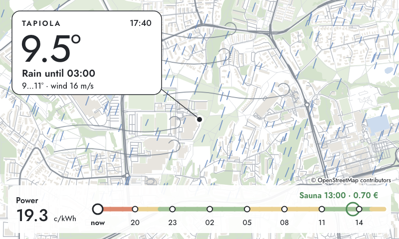 | 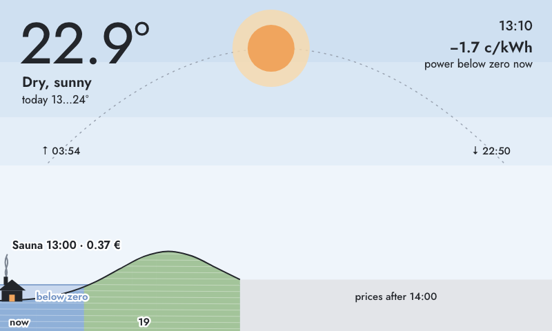 |
| Neighbourhood · autumn storm | Horizon · windy Sunday, prices below zero |
| 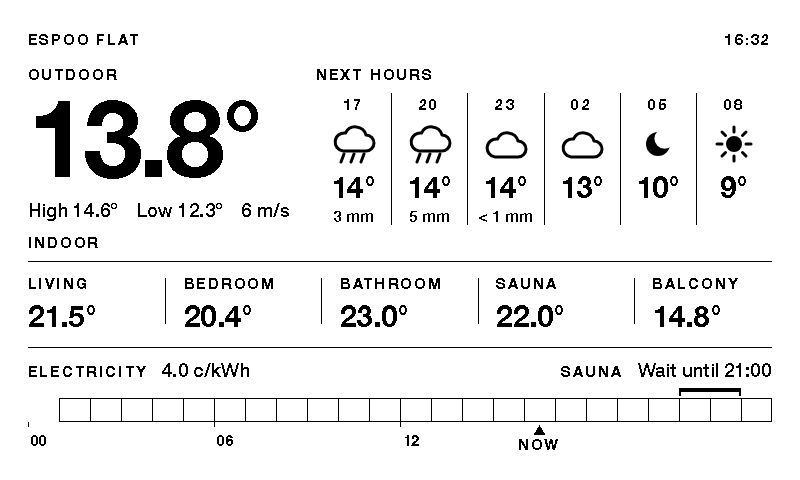 | 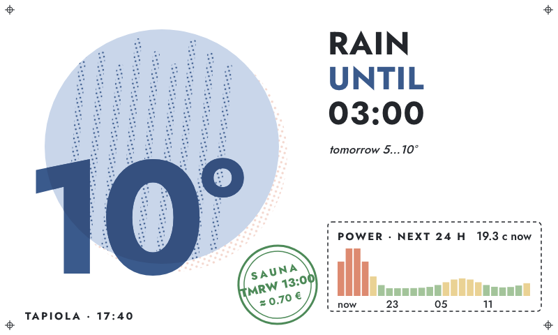 |
| Forecast · Hours (1-bit, live data) | Riso · autumn storm |

The physical side of the project, choosing real sensors and radios, lives in [HARDWARE.md](HARDWARE.md).

## Quick start

```sh
npm install
npm run dev        # 3D flat at http://localhost:5173, dashboards at /dashboard.html
```

Requirements: Node (Vite 8, three.js r186). Python 3 stdlib only if you rebuild the floorplan geometry. Poppler (`pdfimages`) only if you re-extract the plan from the brochure PDF, which is not in git.

---

## 1. The 3D apartment

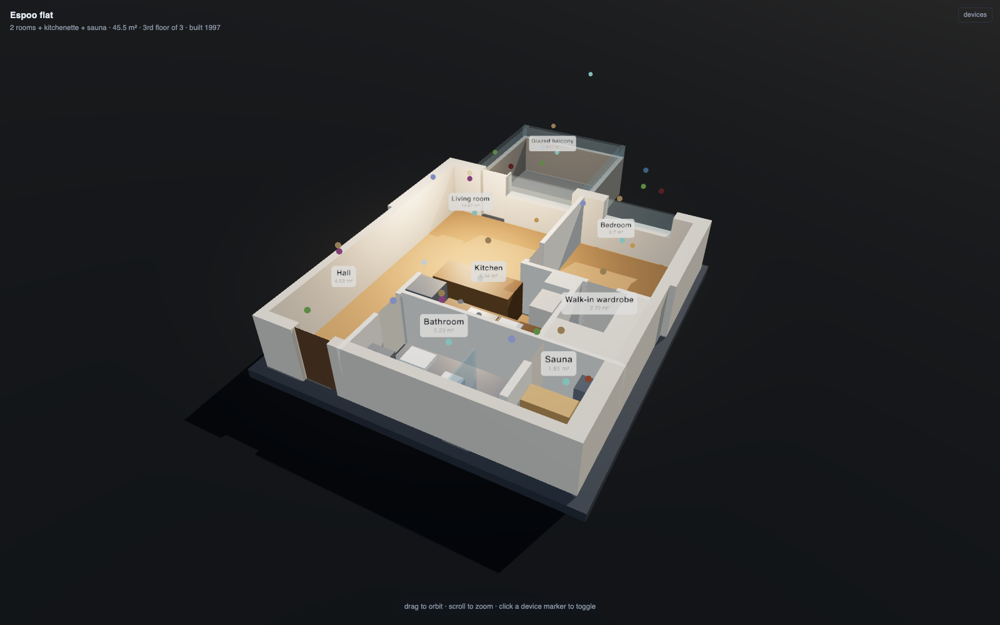

A cut-away dollhouse model of the flat with every light, sensor, appliance and opening as a clickable device.

### Controls

| Action | Effect |
|---|---|
| drag / scroll | orbit and zoom |
| click a marker | toggle that device |
| `cut` slider | raise or lower the section plane through the walls |

`window.bus`, `window.plan`, `window.scene` and `window.view` are exposed in the devtools console:

```js
bus.set('light.sauna', { on: true })
bus.set('contact.front_door', { open: true })
bus.snapshot()
```

### Devices

41 devices across 8 rooms: dimmable ceiling lights, blinds, door and window contacts, motion, temperature and humidity, radiator valves, the sauna heater, bathroom underfloor heating, appliance power, water-leak sensors, smoke alarms, and supply and extract ventilation.

Each device has an `id` such as `light.living`, a `kind`, a world position and a list of `controls` the side panel renders generically. Adding a device is one entry in `src/devices.js`. `src/automations.js` holds example rules: motion lighting, humidity boost, leak alarm.

### Geometry

The floorplan in the brochure is an 800×600 raster, not vector art, so the geometry is traced from pixels:

1. `pdfimages` extracts the plan at native resolution.
2. Wall pixels are isolated by colour and decomposed into axis-aligned rectangles.
3. Those rectangles are the constants in `tools/derive_floorplan.py`.
4. Scale is solved from the listed 45.5 m² living area, giving 22.42 mm per source pixel and a 6.46 × 7.09 m interior.

`npm run floorplan` regenerates `data/floorplan.json`. The script refuses to write if any two solids interpenetrate, because coplanar overlapping faces z-fight and the fixture visibly flickers. Touching is fine.

### Connecting real devices

Nothing outside `src/adapters/` knows where state comes from. `src/adapters/mqtt.js` implements the topic convention `flat/<deviceId>/state` inbound and `flat/<deviceId>/set` outbound, but is not wired in yet. To use it:

```sh
brew install mosquitto
# /opt/homebrew/etc/mosquitto/mosquitto.conf:
#   listener 1883
#   listener 9001
#   protocol websockets
#   allow_anonymous true
brew services start mosquitto
npm install mqtt
```

Then in `src/main.js` replace `startMock(bus)` with:

```js
import { connectMqtt } from './adapters/mqtt.js';
await connectMqtt(bus, { url: 'ws://localhost:9001' });
```

A Home Assistant WebSocket client and an `entity_id → device id` map would go in the same place.

---

## 2. E-ink dashboards

| | |
|---|---|
| 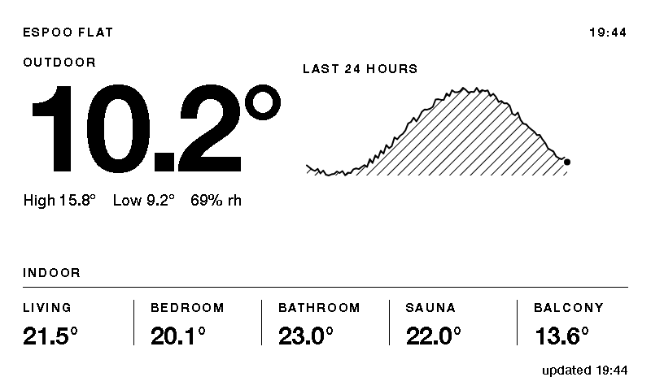 | 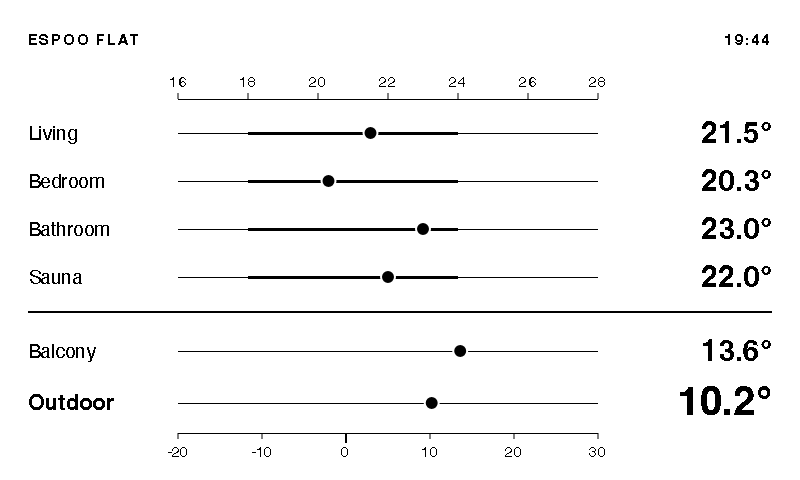 |
| Lead | Dots |
| 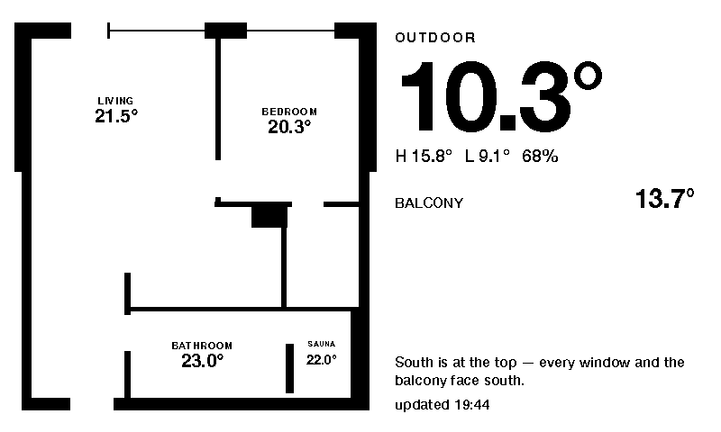 | 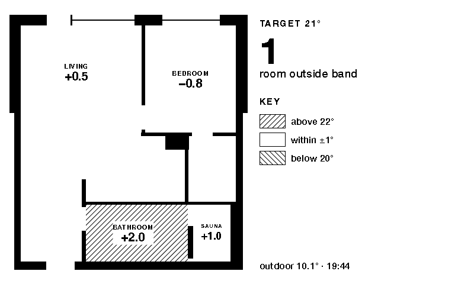 |
| Plan | Drift |
| 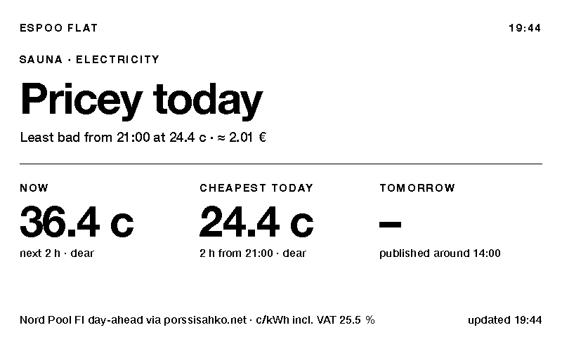 | 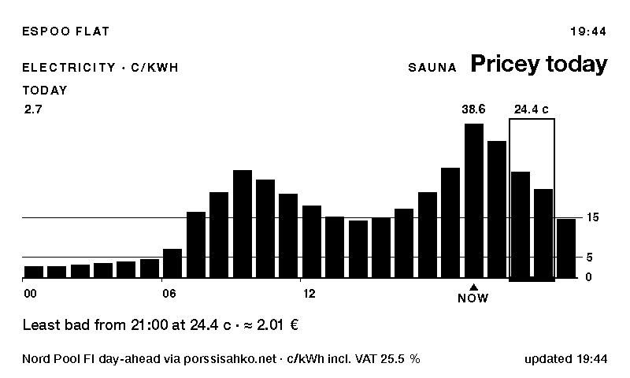 |
| Verdict | Hours |
| 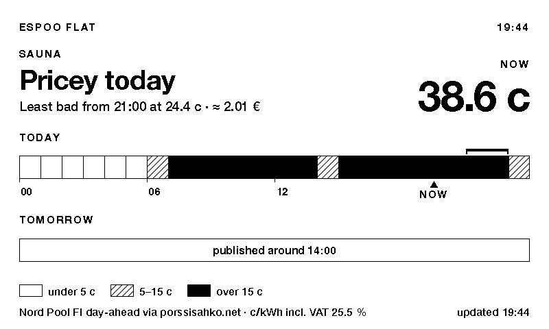 | 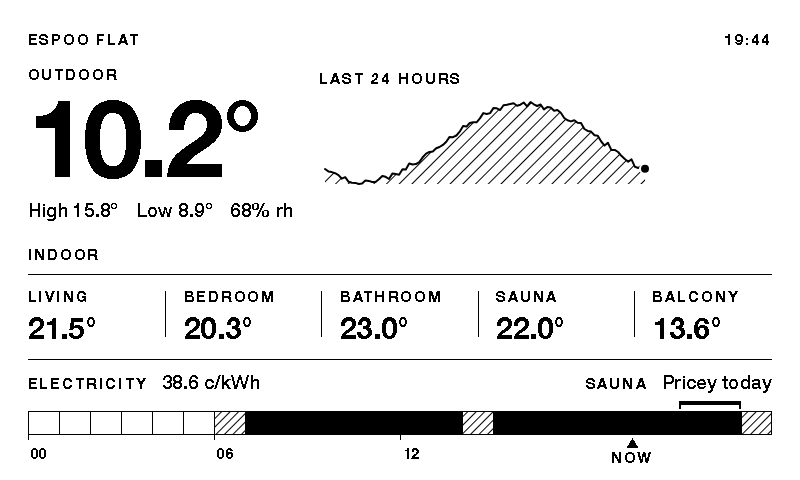 |
| Ribbon | Lead + price |

`dashboard.html` renders candidate layouts for a 7.5″ 800×480 1-bit e-ink panel. They are driven by the same device registry and mock feed as the 3D view, plus live Nord Pool spot prices, so every number on them is real state rather than a mockup. The captures above are 1:1 exports.

The first two tabs, Climate and Electricity, answer two questions. Forecast, Colour and Colour, fresh come after them.

### Climate: how is the flat doing?

| Design | Character |
|---|---|
| **Lead** | Hero outdoor figure + 24 h trend, rooms as a KPI strip |
| **Ledger** | Pure typography, no marks. Least ink, fastest refresh |
| **Split** | Outdoor block beside per-room comfort meters (18–24 °C band) |
| **Grid** | Six equal stat tiles with sparklines |
| **Bare** | One number plus a thin strip of context |
| **Dots** | Every room on one shared 16–28 °C track, comfort band heavier |
| **Plan** | The floorplan, each room carrying its own reading |
| **Thermal** | Rooms filled with an ordered hatch, denser is warmer |
| **Drift** | Deviation from a 21 °C setpoint, hatch direction carries the sign |
| **Atlas** | Small plan as an orientation key beside a value column |

The plan-based designs draw `data/floorplan.json` through `src/dashboard/plan2d.js`, a flat SVG renderer with no three.js dependency, which keeps the dashboard bundle around 11 kB. Only rooms with their own sensor get a number. Kitchen and hall are shaded from the living-room sensor, because they share that open volume, but are not labelled.

### Electricity: is now a good time to heat the sauna?

Finland is a single Nord Pool zone and the day-ahead price swings by an order of magnitude within a day, so the answer is mostly "when", not "whether".

| Design | Character |
|---|---|
| **Verdict** | The answer in words as the hero; three stat tiles behind it |
| **Hours** | Today and tomorrow as hourly columns; the sauna window framed |
| **Ribbon** | One cell per hour, classed cheap / normal / dear. A timetable, not a chart |
| **Session** | The price of one sauna in euros, and what waiting would save |
| **Lead + price** | The Lead climate layout with today's ribbon and the verdict along the bottom |
| **Plan + price** | The Plan layout with the right column split between outdoor and electricity |

Data flow:

- `src/adapters/porssisahko.js` fetches the FI day-ahead series from [api.porssisahko.net](https://porssisahko.net), c/kWh incl. 25.5 % VAT, 48 h rolling, folded to hourly means. `vite.config.js` proxies `/api/porssisahko/*` in dev because the API sends no CORS header. On failure it substitutes a shaped synthetic day and the footers say so.
- Tomorrow's prices appear around 14:00 Finnish time. Before that the designs say so rather than drawing nothing.
- `src/prices.js` holds the store and the decision model. Tunable constants: `BANDS` (cheap ≤ 5 c, dear > 15 c), `FIXED_C_PER_KWH` (transfer + tax, 7.5 c, replace with your bill), and `SAUNA` (1.5 h at 70 % duty on the 6 kW `heater.sauna`, ≈ 6.3 kWh, 2 h window, start hours 07–22).

The verdict compares the next two hours with the cheapest remaining window today and tomorrow. A window only wins if it is at least 30 % and 1 c cheaper, so on a near-zero day the answer is simply "now". States: `now`, `wait`, `tomorrow`, `later`, `done`.

### Design rules for 1-bit e-ink

- **Temperatures are headline numbers, not charts.** Climate designs use stat tiles, KPI rows and hero figures. The only plotted marks are sparklines, each beside its current value with high and low labelled. Prices are a schedule you read the shape of, so Hours and Ribbon do plot them, but still print the verdict in words.
- **No greys.** A 1-bit panel dithers them and thin text falls apart. Areas are black, white, or a 45° hatch.
- **Hatch lines are 2 px.** A 1 px hatch antialiases to mid-grey and disappears when the panel driver thresholds at 50 %. Rendering and hard-thresholding the designs is part of checking them.
- Nothing below 15 px, hairlines at exactly 1 px, no sub-pixel geometry.
- **Labels fit the room, never the reverse.** An oversized label pill punches a hole in the wall fill and reads as a doorway.
- Drift is mostly white, so it refreshes faster and ghosts less than Thermal, and it answers "does anything need attention?" directly.
- Outdoor comes from `climate.outdoor`, a weather feed. The glazed balcony runs about 3 °C warm and is deliberately not used as a stand-in.

URL parameters: `?only=<id>` renders one panel at 1:1 with no page chrome, for capture or for the device. `?at=HH:MM` freezes the clock so other verdicts can be inspected.

### Forecast: what will the rest of the day do?

The Forecast tab keeps Lead + price and replaces its "last 24 hours" block with the rest of the day. Outdoor now and the forecast are real FMI data for Tapiola. The big figure stays the observed temperature. Under it, the high and low are for the calendar day, observed since midnight plus forecast to midnight, followed by the wind.

| Design | Character |
|---|---|
| **Today** | 00–24 as one line: observed solid and hatched, forecast dashed, rain as black bars. The scale spans at least 8 °C, so a flat day draws flat |
| **Hours** | The next 18 h as six 3-hourly columns: time, icon, temperature, rain |
| **Parts** | The next three parts of the day as tiles. The night shows its low, the others their high |
| **Words** | The one change in the next 12 h as a sentence ("Rain until 22:00"), plus tomorrow on one line |

| | |
|---|---|
|  | 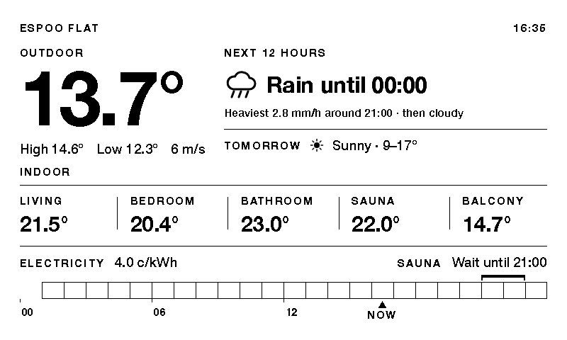 |
| Hours | Words |

`src/weather.js` holds the forecast model (`outlook`, `todayRange`, `dayParts`, `tomorrow`), and `src/dashboard/wicons.js` the 1-bit weather icons.

### Colour: the same designs on a colour e-ink panel

The Colour tab renders the wall designs for a six-ink Spectra 6 panel (black, white, red, yellow, blue, green; the 7.3″ version is also 800×480). The preview uses the pigments' real, muted tones. Colour has exactly four roles, set in `src/dashboard/palette.js`:

| Role | Ink | Where |
|---|---|---|
| sun | yellow | the sun disc in weather icons, with a black edge because yellow alone is faint |
| rain | blue | drops and flakes in icons, the rain bars on Today |
| dear | red | hours over 15 c on the price ribbon |
| go | green | the recommended sauna window bracket |

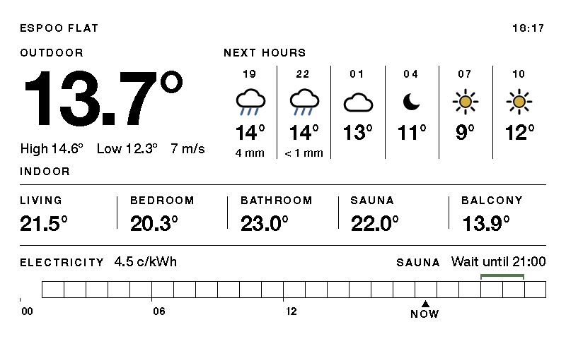

Text, numbers, rules and the hero stay black, so every design still reads if the colour is thresholded away. `MUTED` is the on-screen preview. `PURE` holds the primaries to send the panel driver, which maps each pixel to its nearest ink.

### Colour, fresh: layered, artistic proposals

Four designs for a colour panel, each built as one SVG painted back to front, so the layers are literal. They use soft tints (which the Spectra 6 driver dithers from its six inks), Jost (bundled via `@fontsource-variable/jost`), and ink text that never goes below 15 px. The only exception is the map credit. Every design carries the electricity price and the sauna recommendation.

| Design | Layers |
|---|---|
| **Neighbourhood** | The streets, buildings, parks and pond around the Tapiola station, with the weather painted over them: a sun the roads run across, rain streaks, snow, fog banks, wind strokes, or the same map by night with stars. Power is a transit line: stops are hours, the line's colour is the tariff, and the sauna window is a ringed stop |
| **Horizon** | A landscape. The sky's bands show time of day and weather. The sun or moon sits on its real sunrise–sunset arc. The hills are the next 24 h of prices: fields coloured by tariff, a lake where the price goes below zero, a pale plain where prices are not yet published, and a sauna cabin smoking at the cheapest window |
| **Dial** | A 24 h clock face with noon at the top. From the inside out: temperature as a polar line, rain ticks, daylight arc, then price as radial bars. One hand shows now, and the sauna window is a green arc on the rim |
| **Riso** | A risograph poster: two inks overprint where they cross, plus an off-register halftone. The temperature is set huge and the outlook as stacked words. The tariff is a ticket stub and the sauna is a rubber stamp |

Negative prices get their own colour (blue), apart from cheap.

| | |
|---|---|
|  | 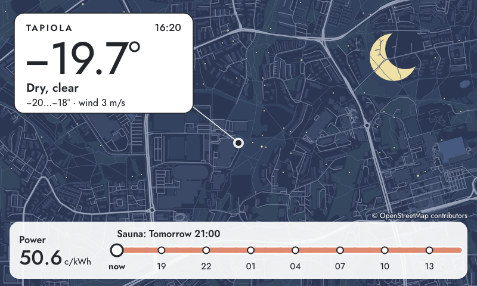 |
| Neighbourhood · autumn storm | Neighbourhood · cold snap, after dark |
| 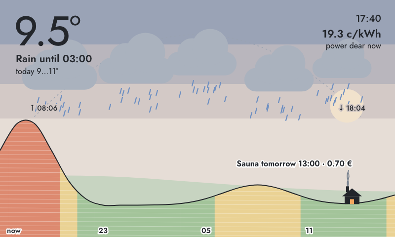 |  |
| Horizon · storm at dusk, sauna tomorrow | Horizon · price lake below zero |
| 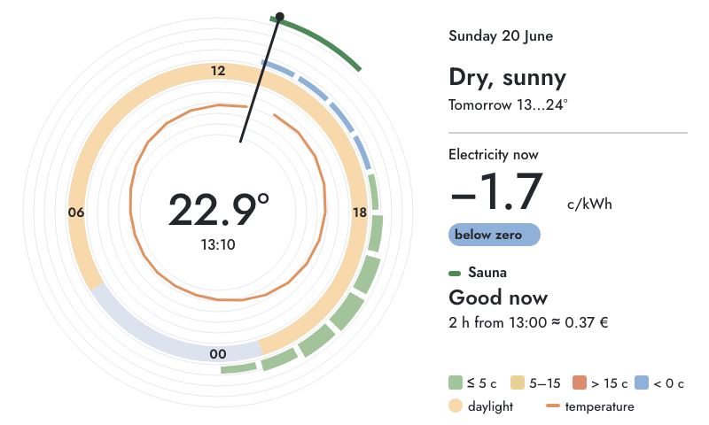 |  |
| Dial · windy Sunday | Riso · autumn storm |

**Scenarios.** One live afternoon only shows one of the states a design has to handle, so the tab renders every design across synthetic days from `src/dashboard/scenarios.js`:

| Scenario | Moment | What it tests |
|---|---|---|
| Autumn storm | October, 17:40 | Heavy rain and gusts at dusk, a 30 c evening price spike, sauna tomorrow |
| Cold snap | January, 16:20 | −20 °C after dark, 50 c power all day |
| Windy Sunday | June, 13:10 | 23 °C sun, negative midday prices, tomorrow not yet published |
| Spring sleet | April, 08:15 | Sleet through the morning price peak |
| Still fog | November, 07:05 | Fog before dawn, flat prices |

Each scenario fills the same stores the live adapters do, so sunrise and sunset, the outlook sentence and the sauna verdict all come out of the real code. Pick one with the chips, or use `?scenario=<id>|all|live`. `?only=<design>--<scenario>` captures one panel.

**The map** is baked by `tools/fetch_osm.mjs` into `data/tapiola-map.json` (~200 kB, one SVG path per layer). It covers 2.4 × 1.45 km at exactly the panel's aspect ratio. It is centred on the public FMI station, not on the flat. Map data © OpenStreetMap contributors, ODbL; the panel prints the credit.

### The real panel

`panel.html` shows Lead + price and the four forecast views on live data. It is the page meant for the wall:

| Part | Source |
|---|---|
| Outdoor now, 24 h trend, high / low, humidity | FMI open-data observations, Espoo Tapiola station (fmisid 874863), 10 min steps. `src/adapters/fmi.js` |
| Price ribbon, current price, sauna verdict | Nord Pool FI day-ahead via porssisahko.net, as above |
| Forecast views | FMI edited point forecast for the same spot, hourly |
| Indoor strip | Still the mock, labelled **Indoor · simulated** until the room sensors exist |

By default the page cycles through the views, one per minute (`?every=<seconds>` changes that). `/views/<id>` or `?view=<id>` pins one view, and `/views` lists them. In a browser, a click or the arrow keys step to the next view. The view is picked from the clock, so a browser and `/panel.png` show the same one.

If a feed is down or has no data, the header says `No weather` or `No prices` beside the clock, and missing readings print as `–`. It never shows a made-up number as if it were live. In dev it is at `http://localhost:5173/panel.html`.

### Hosting it at home

`server/index.mjs` is a small Node server with no dependencies. It serves the built pages, relays FMI and porssisahko with a cache (on an upstream outage it keeps serving the last good answer), and renders the panel to a PNG:

```sh
npm run build
PORT=8080 npm run serve
```

| URL | For |
|---|---|
| `http://<host>:8080/` | e-ink devices with a browser (Boox, a jailbroken Kindle, an old tablet). Cycles through the views and redraws once a minute |
| `http://<host>:8080/views/<id>` | one view, pinned |
| `http://<host>:8080/panel.png` | devices without one (ESP32 + Waveshare 7.5″, Inkplate, TRMNL in BYOS mode). An 800×480 screenshot, regenerated at most once a minute. Takes `?view=` and `?every=` too |
| `http://<host>:8080/healthz` | upstream and renderer status |

The PNG needs Chrome or Chromium on the host (`sudo apt install chromium` on a Pi; set `CHROME=/path` if it is somewhere unusual). It renders in `Europe/Helsinki` time (override with `PANEL_TZ`). It is still an RGB image with antialiased glyph edges, so the device thresholds it to 1-bit. The designs are drawn to survive that.

To keep it running on a Raspberry Pi or other Linux box, `/etc/systemd/system/eink-panel.service`:

```ini
[Unit]
Description=E-ink panel server
After=network-online.target

[Service]
WorkingDirectory=/home/pi/smarthome_stuff
ExecStart=/usr/bin/node server/index.mjs
Environment=PORT=8080
Restart=always
User=pi

[Install]
WantedBy=multi-user.target
```

```sh
sudo systemctl enable --now eink-panel
```

---

## 3. Findings so far

What building the live panel and the studies turned up, recorded so it is not rediscovered:

**Data**

- **FMI open data is enough for outdoor.** Espoo Tapiola (fmisid 874863) gives 10-minute observations with 24 h of history, and the edited point forecast gives hourly values a week ahead if you ask for an `endtime`; the default is only three days. No API key is needed. FMI does not supply sunrise and sunset, so `sunTimes()` computes them.
- **The newest FMI row can be empty.** A row for the current 10 minutes appears before its value. Take the latest row that has a temperature, or the panel shows a gap as a reading.
- **porssisahko.net has no CORS header**, so the page cannot call it directly. The dev server and `server/index.mjs` relay it, and FMI is relayed too so the page talks to one origin. The feed is a rolling 48 h window, so today's first hour may already be gone. The ribbon leaves past, unpriced hours blank on purpose.
- **Tomorrow's prices only exist after ~14:00.** Every design has to show "not yet published" instead of a cliff, a flat line or a stretched axis.
- **A dev server started before a proxy was added falls back to `index.html` for the new path with HTTP 200.** A status-code check passes while the data is missing, so check the response body.

**Design**

- **The past 24 hours did not earn their space.** Nobody acts on yesterday. The forecast views put the rest of today there, with the day's high and low combining what has been observed since midnight with what is forecast until midnight.
- **Auto-scaled lines exaggerate calm days.** A 2 °C day filled the same height as a 10 °C one. The forecast and colour charts now span at least 6–8 °C.
- **Designs need scenarios, not one live afternoon.** A single cheap, rainy day never showed red prices, negative prices, night, fog or a "tomorrow" sauna window. Running the same real code on synthetic days (`src/dashboard/scenarios.js`) caught bugs a live check could not: a tomorrow window labelled as today, labels hidden behind hills, fog that turned into white stripes at night, notes running off the edge.
- **Negative prices are a state of their own.** Below zero means you are paid to use power, so the colour designs show it in blue rather than as "very cheap".
- **1-bit and colour want different rules.** 1-bit designs forbid greys and dithering. On a Spectra 6 panel, soft dithered tints are what make the commercial weather frames look calm. Text stays in pure ink either way, because small dithered type breaks up.
- **Colour studies are previews, not proofs.** Every colour is an on-screen stand-in for a dithered pigment. Before choosing, check them on a real Spectra 6 panel, or at least with its six-ink dither simulated.

**Hosting**

- **Headless Chrome often writes the screenshot and then never exits.** The server polls for the file and stops Chrome itself, and uses a fresh profile per render so a second Chrome does not attach to the first.
- **The view is picked from the clock, not from state,** so a browser showing the cycle and a device fetching `/panel.png` always agree without talking to each other.
